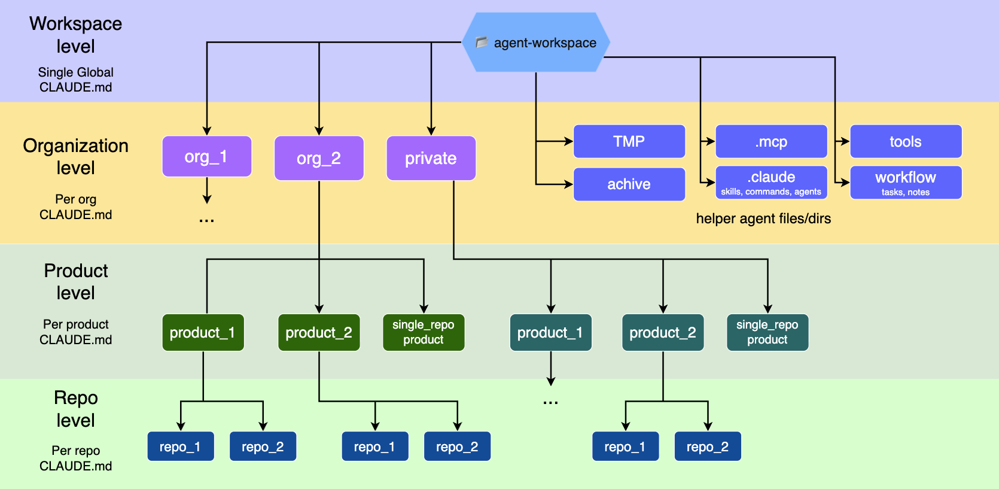

# agent-workspace

A template for a **Claude Code entry-point workspace**: one directory that holds all your organizations, products and repositories, with layered `CLAUDE.md` context files, authoring skills, and a manager agent that helps you set everything up and keep it all up to date.

## Structure

The point: an agent started here quickly finds what it needs to work on, orients itself across the tree, and understands how the repos of a product relate to each other and how products relate between themselves — no repeated intro prompts to bring it up to speed each session.

Context is layered — the agent reads the `CLAUDE.md` chain top-down along its task path and finds the right depth at the right place, with nothing duplicated:

- **Workspace level** — single global `CLAUDE.md`: base agent rules, independent of any company.
- **Organization level** — one directory + `CLAUDE.md` per org; `private/` (personal projects) is an org too.
- **Product level** — `CLAUDE.md` per product: what it is, repo map, how services talk. A single-repo product may sit directly under an org (no product layer).
- **Repo level** — each repository's own `CLAUDE.md`, self-contained, living inside that repo's git (not tracked here). Optionally a personal, gitignored `CLAUDE.local.md` next to it for env-specific details.

To the right of the tree sit the helper dirs: `.claude/` (skills, commands, agents), `.mcp.json`, `tools/`, `workflow/` (operator's task briefs and notes), `TMP/`, `archive/`.

## Quick start

1. Clone this template (or "Use this template") and open it in Claude Code.
2. Run **`/init_workspace_manager`** (or just say "set up my workspace") — it walks you through initializing orgs/products and integrating existing repos (local paths or GitHub/GitLab URLs).
3. Once you have real content, let the agent delete the `org_1/` and `org_2/` mock skeletons.

## What's inside

| Path | Purpose |
|---|---|
| `CLAUDE.md` | Workspace-level rules — the agent's starting point |
| `.claude/` | A starter set of useful skills, commands and agents. The key skills are `claudemd-author` / `claudemd-actualize` — creating and refreshing `CLAUDE.md`/`CLAUDE.local.md` at every level; the `workspace-manager` agent owns them all, but they can be invoked explicitly without it. `workspace-update` refreshes the workspace itself from this template. |
| `.mcp.json` | Default MCP servers (docker, context7, idea, datadog, atlassian, github, playwright) — trim to what you use; prefer `${ENV_VAR}` for tokens |
| `workflow/` | Operator's notes for directing the agent (`task/` briefs, `notes/`) — agents stay out unless pointed at a file |
| `tools/` | Small standalone scripts useful to you or the agent |
| `TMP/` | Scratch space; default output place for generated docs, scripts, reports, screenshots and other temporary files |
| `archive/` | Retired projects and materials |
| `org_1/`, `org_2/` | Mock skeletons: standard org→product→repo shape and the single-repo exception — delete after setup |
| `private/` | Personal-projects org (kept; flexible nesting) |
| `.workspace-meta.yml` | Template provenance (source, version, initialized date) |

This workspace repo tracks **only** the `CLAUDE.md` files down to product level plus the helper dirs; repository contents are gitignored (see `.gitignore` for the per-org block pattern).

## Maintaining

- **`claudemd-author`** — creates `CLAUDE.md` at any level (and `CLAUDE.local.md`) with the fixed per-level section structure, stamped `*Actualized: YYYY-MM-DD*`.
- **`claudemd-actualize`** — refreshes an existing file against reality since its date stamp (commits, code, your org's docs via MCP): removes stale, inserts current truth, updates the stamp.
- **`workspace-update`** — refreshes the workspace itself from this template (skills, commands, agents, base instructions) without touching your content; conflicts are shown, never auto-resolved.

All context-file work goes through these skills, so the structure stays consistent no matter who runs it.
